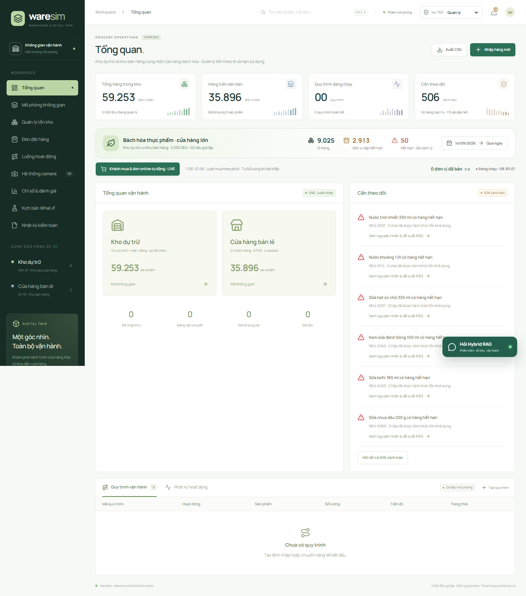
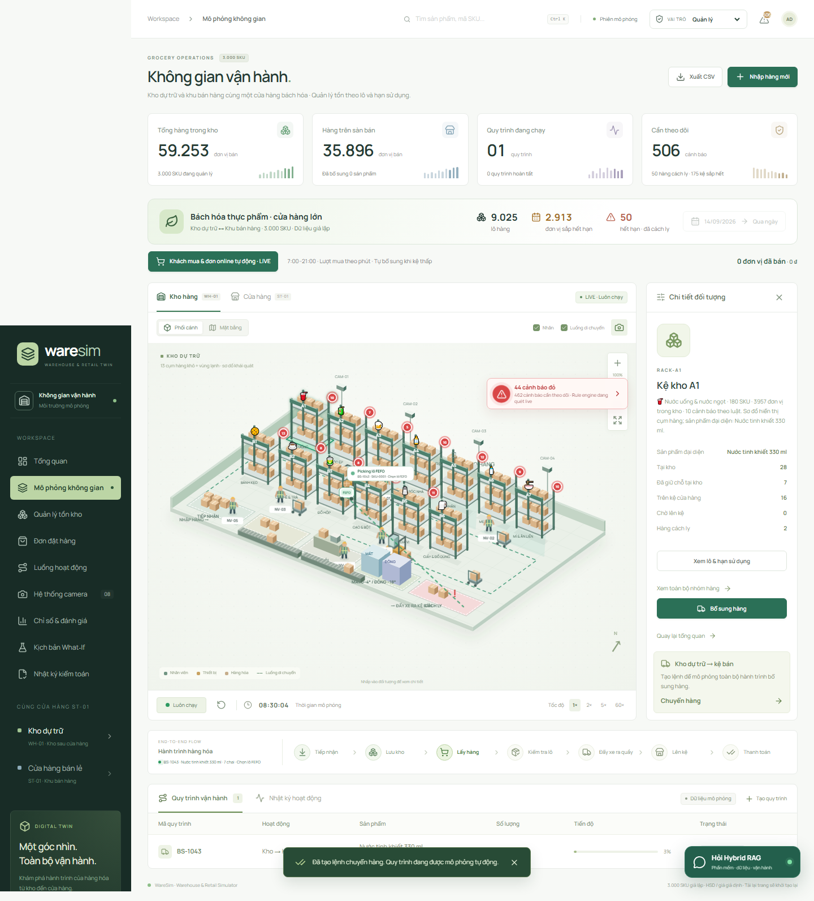
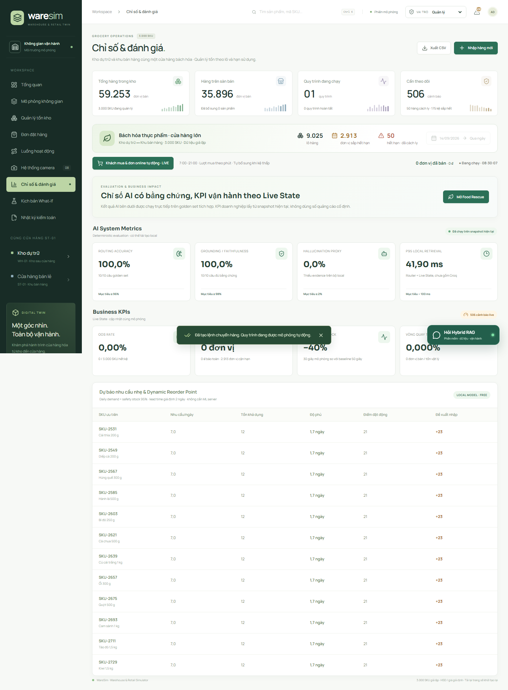
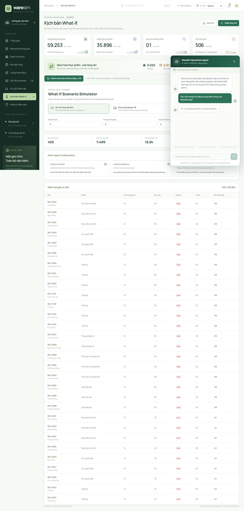
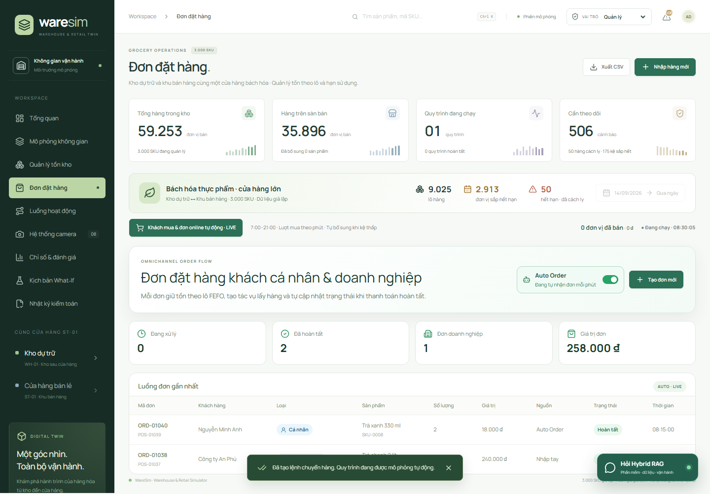
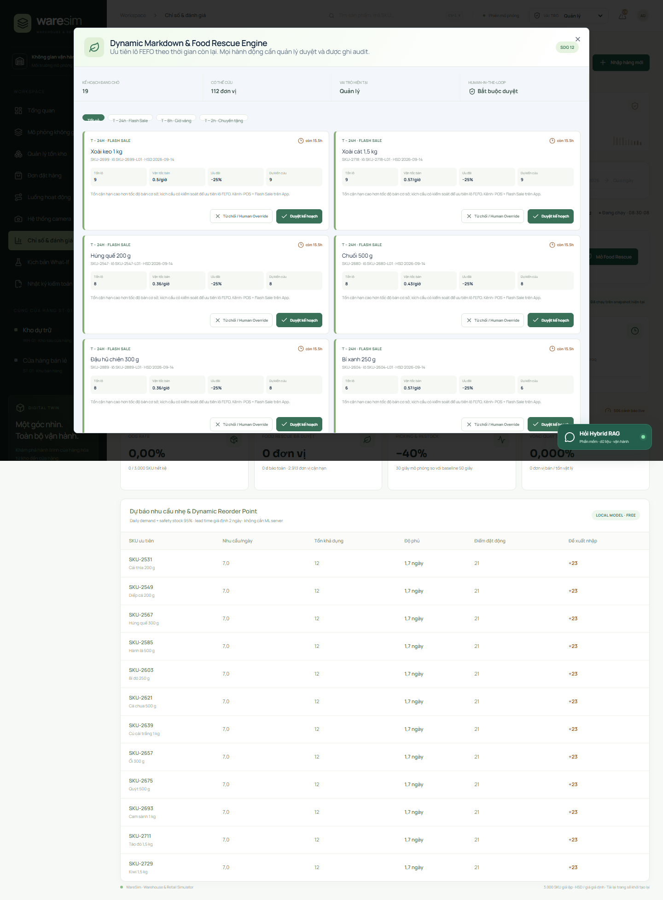
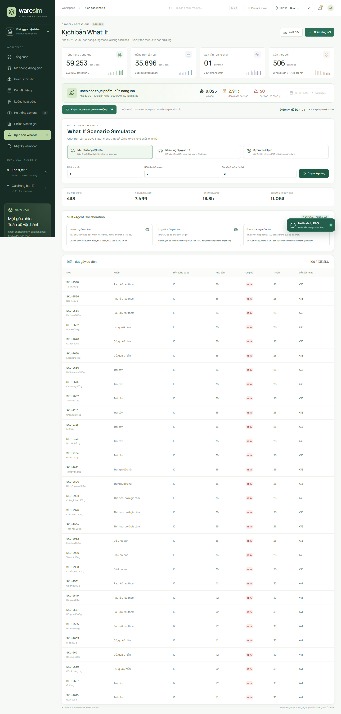

# WARESIM AI

## Digital Twin có kiểm chứng cho kho và cửa hàng bách hóa

BẢN TÓM TẮT GỬI CHUYÊN GIA — BẢNG C SINH VIÊN

Mô phỏng FEFO/HSD, đơn hàng, cảnh báo, Hybrid RAG và hỗ trợ quyết định có Human‑in‑the‑loop trên cùng một Live State.

| 3.000 SKU | 9.025 lô | 28/28 kiểm thử đạt |
| --- | --- | --- |

Tài liệu xin góp ý chuyên môn — 15/09/2026

---PAGE---

# 1. Bài toán và giải pháp

## Vấn đề

- Hết hàng trên kệ dù kho còn hàng.
- Khó ưu tiên lô cận hạn và giảm lãng phí.
- Đơn cá nhân/doanh nghiệp cạnh tranh cùng tồn.
- LLM dễ trả lời trôi khỏi số liệu vận hành.
- Khuyến nghị AI thiếu bằng chứng và trách nhiệm.

## Cách tiếp cận

- Canonical simulator quản lý SKU/lô và FEFO.
- Rule Engine phát hiện ngoại lệ xác định.
- RAG truy xuất state/SOP trước khi gọi Groq.
- What‑If chạy trên bản sao, không đổi tồn thật.
- RBAC, human approval và audit hash chain.

> Live State → Rule/Retrieval → Groq diễn giải → Con người duyệt → Audit.

Dashboard vận hành: số liệu được tính trực tiếp từ snapshot của phiên.

---PAGE---

# 2. Chức năng và vận hành

| Chức năng | Giá trị |
| --- | --- |
| Kho và cửa hàng | WH‑01 và ST‑01 dùng chung state theo lô |
| FEFO/HSD | Reservation, transit, backroom, cách ly |
| Đơn hàng | Cá nhân, công ty/đơn vị và Auto Order |
| Cảnh báo | OOS, tồn thấp, cận hạn, hết hạn |
| Food Rescue | Markdown động và chuyển tặng |
| What‑If | Nhu cầu tăng, giao trễ, chuỗi lạnh |

Hoạt ảnh bám theo mã tác vụ, SKU và bước nghiệp vụ đang chạy.

> Bất biến: kho + kệ + transit + backroom + cách ly = tồn đầu + nhập − bán.

---PAGE---

# 3. Điểm mới của phiên bản hiện tại

## Hybrid Real‑Time RAG

Live State cho số hiện tại, Event History cho lịch sử, Knowledge RAG cho SOP. Groq là lớp diễn giải tùy chọn; fallback local vẫn hoạt động.

## Decision intelligence

Dynamic Reorder, Food Rescue, What‑If và ba agent chuyên trách dùng cùng snapshot, không tự phát lệnh ngoài quyền.

## Governance by design

RBAC ba vai trò, prompt guardrail, secret server-side, Human Override và audit hash chain.

## Free-tier ready

Core chạy local không database/LLM; production bundle nhắm Cloudflare Workers và có health/API bridge.

Dashboard đánh giá local và câu trả lời Groq có model, nguồn, snapshot và dữ liệu đối chiếu.

---PAGE---

# 4. Các luồng quyết định

## Đơn hàng và Auto Order

Đơn cá nhân/doanh nghiệp giữ tồn FEFO và cập nhật trạng thái theo tác vụ POS.

## Food Rescue

T−24h/T−8h/T−2h đề xuất markdown/chuyển tặng; Quản lý duyệt hoặc Human Override.

## What‑If và ba agent

Inventory Guardian, Logistics Dispatcher và Store Manager Copilot phân tích trên bản sao Live State.

> AI đề xuất và giải thích; Rule Engine xác định; canonical simulator thực thi; con người chịu trách nhiệm quyết định.

---PAGE---

# 5. Kiểm chứng, giới hạn và đề nghị góp ý

## Đã kiểm chứng

- 28/28 test: FEFO, reservation, HSD, bất biến tồn, Auto Order, RBAC, guardrail, RAG và UI desktop/mobile.
- TypeScript và production Cloudflare build đạt.
- Groq server-side đã smoke test.
- Golden set local có thể tái chạy.

## Giới hạn hiện tại

- Dữ liệu giả lập, chưa hiệu chỉnh cửa hàng thật.
- State theo phiên trình duyệt, chưa persistent/multi-user.
- Metrics local chưa thay benchmark độc lập.
- Audit RAM chưa phải lưu vết pháp lý.
- API bridge chưa có projector production.

## Câu hỏi xin chuyên gia phản biện

1. Nên ưu tiên OOS, Food Rescue hay điều phối đơn làm use case pilot?
2. Digital Twin cần thêm biến hoặc độ chi tiết nào?
3. Benchmark/baseline phù hợp để đánh giá RAG và What‑If?
4. Dữ liệu thật tối thiểu nào đủ để hiệu chỉnh?
5. Threat model và governance còn thiếu điểm nào?
6. Lộ trình ba tháng nên ưu tiên persistence, POS connector hay forecasting?

## Phù hợp trọng tâm Bảng C

Giá trị thực tiễn · Dữ liệu và mô hình · Chỉ số đo lường · Bảo mật · Đạo đức AI · Khả năng triển khai.

Thể lệ tham khảo: https://ai.tainangviet.vn/bang-thi/C và https://ai.tainangviet.vn/ho-so. PDF dự thi Bảng C tối đa 20 trang; video thuyết trình và demo tối đa 5 phút; phải kê khai trung thực AI, dataset, API, thư viện và phần tự xây dựng.
